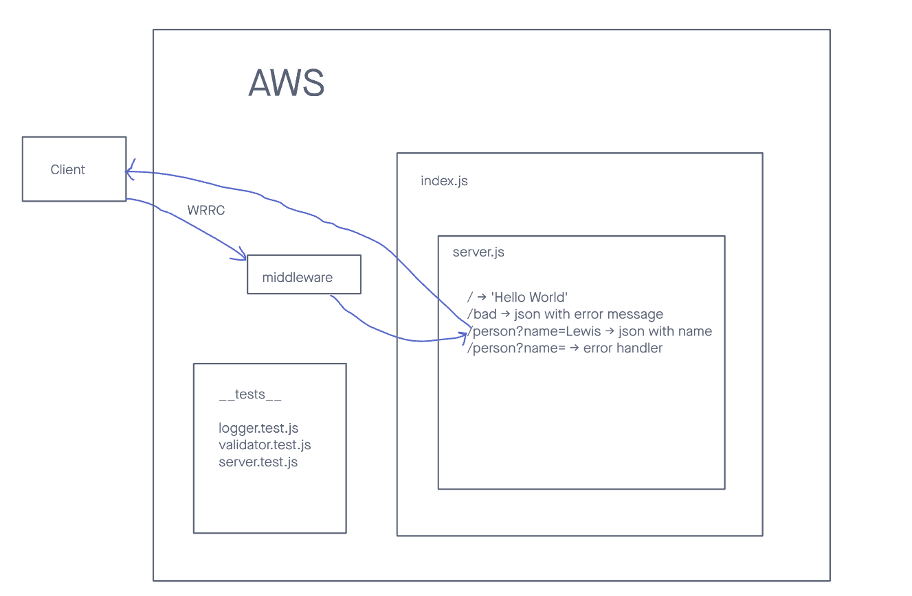

# LAB - 401-D49 Lab-16

## Project: Cloud-server

### Author: Lewis Benson

### Problem Domain

Build a basic express server, and deploy it to AWS using GUI, and beanstalk CLI

### Links and Resources

- [ci/cd](https://github.com/tm-LBenson/cloud-server/actions) (GitHub Actions)
- [server-prod-cli](http://d49cloudserver-env.eba-ykapze4m.us-east-1.elasticbeanstalk.com/)
- [server-prod-upload-zip](https://d49-cloud-server-dev.us-east-1.elasticbeanstalk.com/)

### Setup

#### `.env` requirements (where applicable)

There are no env requirements

- PORT is set to process.env or 3001.
  Application will run locally or deployed to AWS without setting any parameters manually

#### How to initialize/run your application (where applicable)

- nodemon
  app.js is the primary JavaScript file for the server, and is located in the root folder.

#### Steps to deploy to AWS

Compress all essential files to a zip

Click services on the nav bar

Hover `compute` -> click on Elastic Beanstalk

Click Create new application >

Fill out form for name, select Node.js, leave everything to default
select source code
upload the zip file

The build is complete.

Create a group for the user permissions

Create a user and assign new group to user

Add AdministratorAccess-AWSElasticBeanstalk
Add AWSCodeCommitFullAccess

\***\*\*\*\*\***\_\_\_\***\*\*\*\*\***CLI**\*\*\*\***\_\_\_**\*\*\*\***

in terminal type aws configure

input access key and secret key for user permissions

in terminal type eb init
follow on screen commands, change inputs as needed

Say no to CodeCommit

type eb create in terminal

press enter three times

do not enable ANYTHING

After making changes to server use eb deploy to apply changes.

#### Features / Routes

- Feature one: Deploy to AWS

- GET : `/` - specific route to hit
- GET : `/bad` - specific route to hit
- GET : `/name?name=string` - specific route to hit (string can be replaced with a name)
  - NOTE: The original path name for zip upload version is `/person` it was changed to `/name` to test the `eb deploy`
- Feature two: Deploy with Beanstalk CLI

#### Tests

- How do you run tests?
  - npm test
- Any tests of note?
  - handles root path
  - handles invalid paths
  - handles error code 500
- Describe any tests that you did not complete, skipped, etc

#### UML

Link to an image of the UML for your application and response to events

# cloud-server
